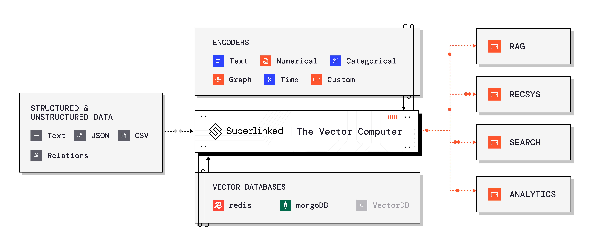

# Welcome

Superlinked is a compute framework for your information retrieval and feature engineering systems, focused on turning **complex** (structured + unstructured) data into ultra-modal vector embeddings within your RAG, Search, Recommendations and Analytics stack. Integrate Superlinked into your machine learning stack for custom model performance with pre-trained model convenience.

### Discover Superlinked

<table data-view="cards">
<thead>
<tr><th></th><th></th><th data-type="content-ref"></th><th data-hidden data-card-cover data-type="files"></th><th data-hidden data-card-target data-type="content-ref">
</th></tr>
</thead>
<tbody>
    <tr>
        <td><strong>Getting Started</strong></td>
        <td>Begin your journey with Superlinked by setting up and understanding the basics.</td>
        <td></td>
        <td><a href=".gitbook/assets/getting-started-thumbnails/getting started.png">getting started.png</a></td>
        <td><a href="getting-started/installation.md">link</a></td>
    </tr>
    <tr>
        <td><strong>Concepts</strong></td>
        <td>Explore the core ideas and principles behind Superlinked's functionality.</td>
        <td></td>
        <td><a href=".gitbook/assets/getting-started-thumbnails/concepts.png">concepts.png</a></td>
        <td><a href="concepts/overview.md">link</a></td>
    </tr>
    <tr>
        <td><strong>Use Cases</strong></td>
        <td>Learn how Superlinked can be applied to solve real-world problems.</td>
        <td></td>
        <td><a href=".gitbook/assets/getting-started-thumbnails/use-cases.png">use-cases.png</a></td>
        <td><a href="use-cases/overview.md">link</a></td>
    </tr>
    <tr>
        <td><strong>Reference</strong></td>
        <td>Access detailed documentation for Superlinked's components.</td>
        <td></td>
        <td><a href=".gitbook/assets/getting-started-thumbnails/reference.png">reference.png</a></td>
        <td><a href="reference/overview.md">link</a></td>
    </tr>
    <tr>
        <td><strong>Changelog</strong></td>
        <td>View the changelog for Superlinked.</td>
        <td></td>
        <td><a href=".gitbook/assets/getting-started-thumbnails/changelog.png">changelog.png</a></td>
        <td><a href="reference/changelog.md">link</a></td>
    </tr>
    
</tbody>
</table>

### Resources

<table data-view="cards">
<thead>
<tr><th></th><th></th><th data-type="content-ref"></th><th data-hidden data-card-cover data-type="files"></th><th data-hidden data-card-target data-type="content-ref">
</th></tr>
</thead>
<tbody>
    <tr>
        <td><strong>VectorHub</strong></td>
        <td>free and open-sourced learning hub for people interested in adding vector retrieval to their ML stack.</td>
        <td></td>
        <td><a href=".gitbook/assets/content-editor.png">content-editor.png</a></td>
        <td><a href="https://superlinked.com/vectorhub" target="_blank">link</a></td>
    </tr>
    <tr>
        <td><strong>Vector DB Comparison</strong></td>
        <td>Open-source collaborative comparison of vector databases by Superlinked</td>
        <td></td>
        <td><a href=".gitbook/assets/content-editor.png">content-editor.png</a></td>
        <td><a href="https://superlinked.com/vector-db-comparison" target="_blank">link</a></td>
    </tr>
    
</tbody>
</table>

### Add this doc to Cursor

<!-- ### GitBook Product Demo

Product Demo
 -->