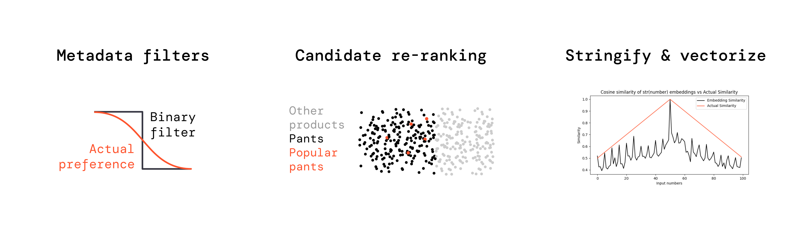

# Why Superlinked?

#### Your users now expect that your search can handle complex queries


Vector Search with text-only embeddings (& also multi-modal) fails on complex queries, because complex queries are never just about text. They involve other data too!


#### With text-only embeddings, you have to handle text separately from your other data and/or use *slow*, *low quality* & *high cost* workarounds

    
Metadata filters

    When you convert a fuzzy preference like “recent”, “risky” or “popular” into a filter, you model a sigmoid with a binary step function = not enough resolution.

    
Candidate re-ranking

    Semantic ranking & ColBERT only use text, learn2rank models need ML Engineers.
    Broad queries eg “popular pants” can’t be handled by re-ranking at all, due to poor candidate recall.

Stringify & vectorize

It’s extremely noisy to stringify & text-embed whole objects like users, SKUs or content+metadata. See below for `cosine(textembed(str(50)),textembed(str(1..100))):`

